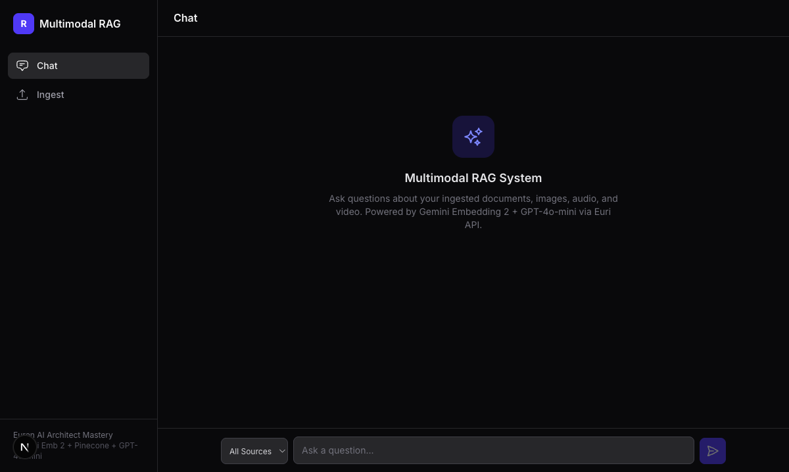
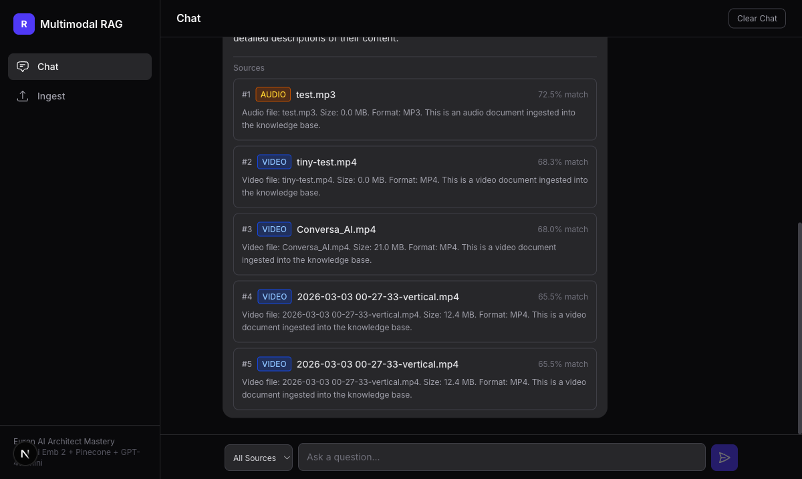
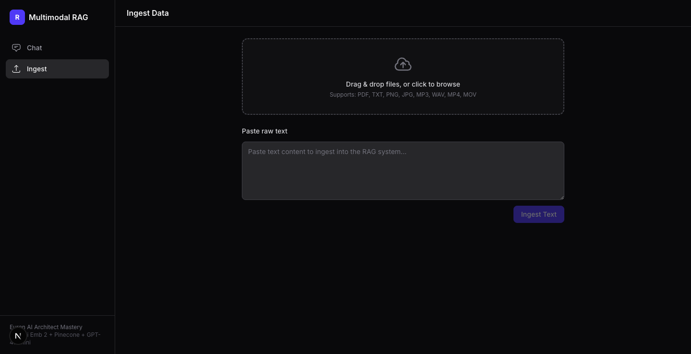

# Multimodal RAG System

A production-grade **Retrieval-Augmented Generation** system that ingests **text, PDFs, images, audio, and video** into a unified vector space. Ask questions across any modality and get streamed AI answers with source citations.



---

## What It Does

Upload any file. Ask any question. Get answers with sources.

- **Text & PDFs** — chunked, embedded, and searchable
- **Images** — described by GPT-4o-mini vision, then embedded for semantic search (e.g., "a boy in black t-shirt")
- **Audio** — transcribed by Whisper, then embedded
- **Video** — frames extracted by ffmpeg, each described by vision AI, then embedded
- **Chat** — real-time token streaming with source citations





---

## Architecture

```
┌─────────────────────────────────────────────────────┐
│                 Next.js Frontend                     │
│   ┌────────────┐    ┌────────────────────────────┐   │
│   │ Ingest Page│    │     Chat Page (SSE)        │   │
│   │ Drag&Drop  │    │ Stream tokens + sources    │   │
│   └─────┬──────┘    └─────────────┬──────────────┘   │
└─────────┼─────────────────────────┼──────────────────┘
          │                         │
          ▼                         ▼
┌─────────────────────────────────────────────────────┐
│                FastAPI Backend                        │
│                                                      │
│  ┌───────────────────┐   ┌────────────────────────┐  │
│  │ Ingestion Pipeline│   │  RAG Query Pipeline    │  │
│  │                   │   │                        │  │
│  │ Text  → Chunk     │   │ Query → Embed          │  │
│  │ PDF   → Extract   │   │ Pinecone Search (top_k)│  │
│  │ Image → Vision    │   │ Build Context          │  │
│  │ Audio → Whisper   │   │ GPT-4o-mini (stream)   │  │
│  │ Video → Frames    │   │ SSE → Frontend         │  │
│  │         + Vision  │   │                        │  │
│  └────────┬──────────┘   └────────┬───────────────┘  │
└───────────┼───────────────────────┼──────────────────┘
            │                       │
            ▼                       ▼
  ┌────────────────────┐  ┌────────────────────┐
  │     Euri API       │  │     Pinecone       │
  │  (OpenAI compat)   │  │   (Serverless)     │
  │                    │  │                    │
  │  Embed: Gemini     │  │  768-dim cosine    │
  │  LLM: GPT-4o-mini  │  │  5 namespaces     │
  │  Vision: GPT-4o    │  │  (text, pdf, img,  │
  │  STT: Whisper      │  │   audio, video)    │
  └────────────────────┘  └────────────────────┘
```

---

## Quick Start

### Prerequisites

- Python 3.11+
- Node.js 20+
- [Euri API key](https://euron.one) — single key for embedding + LLM + vision + transcription
- [Pinecone API key](https://pinecone.io) — free tier works

### Option 1: Local Development

```bash
# Clone
git clone https://github.com/aiagentwithdhruv/multimodal-rag.git
cd multimodal-rag

# Backend
cd backend
cp .env.example .env          # Add your API keys
pip install -r requirements.txt
uvicorn app.main:app --reload --port 8000

# Frontend (new terminal)
cd frontend
cp .env.example .env.local
npm install
npm run dev
```

Open [http://localhost:3000](http://localhost:3000)

### Option 2: Docker

```bash
cp backend/.env.example backend/.env    # Add your API keys
cp frontend/.env.example frontend/.env.local
docker compose up --build
```

---

## Tech Stack

| Layer | Technology |
|-------|-----------|
| **Frontend** | Next.js 15, React 19, TypeScript, Tailwind CSS |
| **Backend** | Python 3.13, FastAPI, Uvicorn |
| **Embedding** | Gemini Embedding 2 Preview (768-dim) via Euri API |
| **Vector DB** | Pinecone Serverless (cosine similarity, 5 namespaces) |
| **LLM** | GPT-4o-mini via Euri API |
| **Vision** | GPT-4o-mini via Euri API |
| **Transcription** | Whisper-1 via Euri API |
| **Video** | ffmpeg (frame extraction) |

> **Euri API** is an OpenAI-compatible gateway — single API key, single base URL for all AI operations.

---

## API Reference

### Ingestion Endpoints

```bash
# Ingest raw text
curl -X POST http://localhost:8000/ingest/text \
  -H "Content-Type: application/json" \
  -d '{"text": "Your content here", "source_name": "my-doc"}'

# Ingest a PDF
curl -X POST http://localhost:8000/ingest/pdf \
  -F "file=@document.pdf"

# Ingest an image
curl -X POST http://localhost:8000/ingest/image \
  -F "file=@photo.jpg"

# Ingest audio
curl -X POST http://localhost:8000/ingest/audio \
  -F "file=@recording.mp3"

# Ingest video
curl -X POST http://localhost:8000/ingest/video \
  -F "file=@clip.mp4"
```

### Query Endpoints

```bash
# Ask a question (JSON response)
curl -X POST http://localhost:8000/query \
  -H "Content-Type: application/json" \
  -d '{"question": "What is in the uploaded image?"}'

# Ask with streaming (SSE)
curl -X POST http://localhost:8000/query/stream \
  -H "Content-Type: application/json" \
  -d '{"question": "Summarize all documents", "source_type": "pdf", "top_k": 5}'

# Health check
curl http://localhost:8000/health

# List ingested files
curl http://localhost:8000/ingested
```

| Method | Path | Description |
|--------|------|-------------|
| `POST` | `/ingest/text` | Ingest raw text |
| `POST` | `/ingest/pdf` | Upload and ingest PDF |
| `POST` | `/ingest/image` | Upload and ingest image(s) |
| `POST` | `/ingest/audio` | Upload and ingest audio |
| `POST` | `/ingest/video` | Upload and ingest video |
| `POST` | `/query` | Ask a question (JSON) |
| `POST` | `/query/stream` | Ask a question (SSE streaming) |
| `GET` | `/health` | Health check |
| `GET` | `/ingested` | List all ingested files |

---

## How It Works

### Ingestion Flow

```
Upload file → Detect modality → Process content → Embed (768-dim) → Store in Pinecone
```

| Modality | Processing |
|----------|-----------|
| **Text** | Chunked (1024 chars, 256 overlap) → embedded |
| **PDF** | Pages extracted → chunked → embedded |
| **Image** | GPT-4o-mini vision describes image → text embedded |
| **Audio** | Whisper transcribes → text embedded |
| **Video** | ffmpeg extracts 3 frames → each described by vision → combined text embedded |

### Query Flow

```
Question → Embed query → Search Pinecone (cosine, top_k) → Build context → GPT-4o-mini streams answer → Source citations
```

---

## Environment Variables

### Backend (`backend/.env`)

```env
EURI_API_KEY=your_euri_api_key
EURI_BASE_URL=https://api.euron.one/api/v1/euri
EURI_EMBEDDING_MODEL=gemini-embedding-2-preview
EURI_LLM_MODEL=gpt-4o-mini
PINECONE_API_KEY=your_pinecone_api_key
PINECONE_INDEX_NAME=rag-multimodal
```

### Frontend (`frontend/.env.local`)

```env
NEXT_PUBLIC_API_URL=http://localhost:8000
```

---

## Project Structure

```
multimodal-rag/
├── backend/
│   ├── app/
│   │   ├── main.py                    # FastAPI app + CORS
│   │   ├── config.py                  # Environment config
│   │   ├── models/schemas.py          # Pydantic models
│   │   ├── services/
│   │   │   ├── euri_client.py         # Shared OpenAI client (Euri)
│   │   │   ├── embedding.py           # Gemini Embedding 2 (768-dim)
│   │   │   ├── vectorstore.py         # Pinecone CRUD
│   │   │   ├── llm.py                 # GPT-4o-mini streaming
│   │   │   ├── vision.py              # Image description
│   │   │   ├── video_vision.py        # Frame extraction + vision
│   │   │   ├── audio_transcription.py # Whisper transcription
│   │   │   └── rag_pipeline.py        # Orchestration
│   │   ├── processors/                # Per-modality processors
│   │   │   ├── text_processor.py
│   │   │   ├── pdf_processor.py
│   │   │   ├── image_processor.py
│   │   │   ├── audio_processor.py
│   │   │   └── video_processor.py
│   │   └── routers/
│   │       ├── ingest.py              # Ingestion endpoints
│   │       └── query.py               # Query endpoints (JSON + SSE)
│   ├── Dockerfile
│   └── requirements.txt
├── frontend/
│   ├── src/
│   │   ├── app/                       # Next.js pages
│   │   │   ├── chat/page.tsx          # Chat interface
│   │   │   └── ingest/page.tsx        # Ingestion dashboard
│   │   ├── components/
│   │   │   ├── chat/                  # ChatWindow, MessageBubble, SourceCard
│   │   │   ├── ingest/               # FileUploader, TextInput, Status
│   │   │   └── layout/               # Sidebar, Header
│   │   ├── hooks/                     # useChat, useIngest
│   │   └── lib/                       # API client, types
│   ├── Dockerfile
│   └── package.json
├── docker-compose.yml
└── docs/screenshots/
```

---

## Key Design Decisions

| Decision | Why |
|----------|-----|
| **Euri API as single provider** | One API key for embedding + LLM + vision + transcription. OpenAI SDK compatible. |
| **Pinecone namespaces per modality** | Enables filtered search (e.g., only images) while keeping a single index. |
| **Vision descriptions for images** | Gemini Embedding 2 is text-only via Euri, so we describe images as text first. |
| **Queue-based async streaming** | Bridges sync OpenAI SDK generators with FastAPI's async event loop cleanly. |
| **ffmpeg for video** | Lightweight, universal frame extraction without heavy ML dependencies. |

---

## Supported File Types

| Type | Extensions | Max Size |
|------|-----------|----------|
| Text | `.txt` | No limit (chunked) |
| PDF | `.pdf` | No limit (paginated) |
| Image | `.png`, `.jpg`, `.jpeg` | 20 MB |
| Audio | `.mp3`, `.wav` | 25 MB |
| Video | `.mp4`, `.mov` | 100 MB |

---

## Contributing

1. Fork the repo
2. Create a feature branch (`git checkout -b feature/amazing-feature`)
3. Commit your changes (`git commit -m 'Add amazing feature'`)
4. Push to the branch (`git push origin feature/amazing-feature`)
5. Open a Pull Request

---

## License

MIT

---

## Author

Built by [Dhruv](https://aiwithdhruv.com) | [GitHub](https://github.com/aiagentwithdhruv) | [LinkedIn](https://linkedin.com/in/aiagentwithdhruv)

Part of the [Euron AI Architect Mastery](https://euron.one) course.
